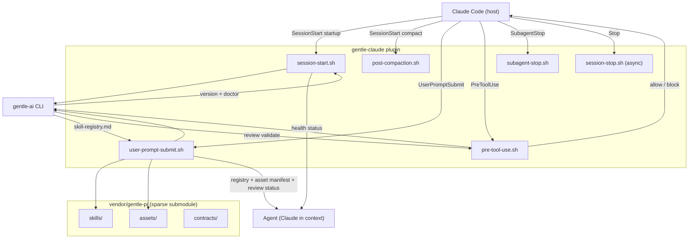
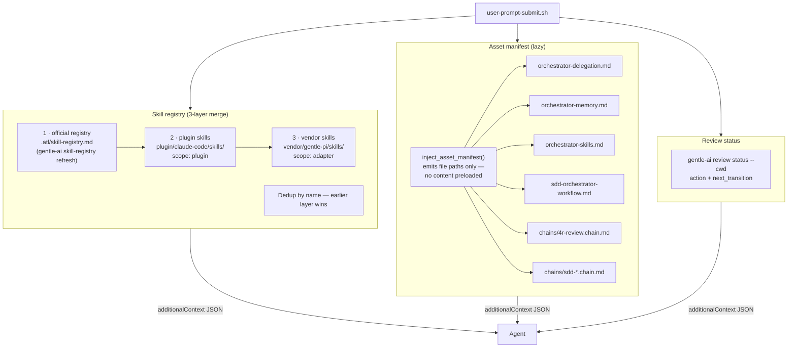
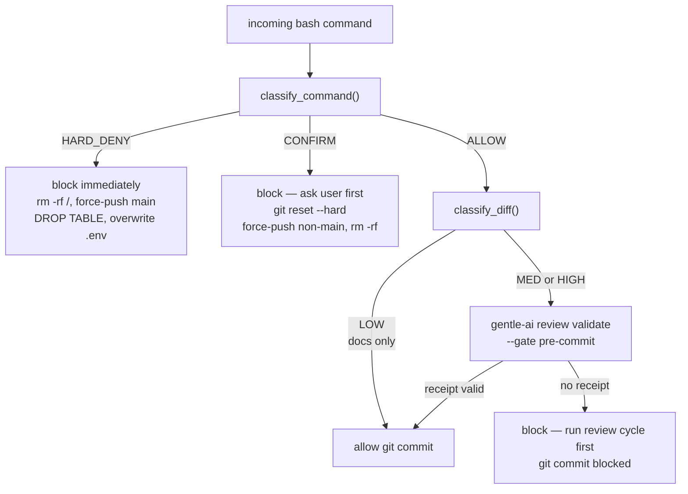
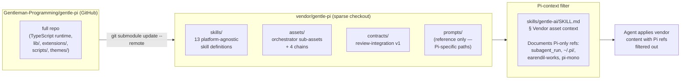

# Flow Diagram

How Claude Code, gentle-claude, gentle-ai CLI, and vendor/gentle-pi interact.

## Lifecycle overview

```mermaid
flowchart TD
    CC["Claude Code (host)"]

    subgraph plugin["gentle-claude plugin"]
        SS["session-start.sh"]
        PC["post-compaction.sh"]
        UPS["user-prompt-submit.sh"]
        PTU["pre-tool-use.sh"]
        AGS["subagent-stop.sh"]
        STO["session-stop.sh (async)"]
    end

    subgraph vendor["vendor/gentle-pi (sparse submodule)"]
        VS["skills/"]
        VA["assets/"]
        VC["contracts/"]
    end

    GA["gentle-ai CLI"]
    AGENT["Agent (Claude in context)"]

    CC -->|SessionStart startup| SS
    CC -->|SessionStart compact| PC
    CC -->|UserPromptSubmit| UPS
    CC -->|PreToolUse| PTU
    CC -->|SubagentStop| AGS
    CC -->|Stop| STO

    SS --> GA
    GA -->|version + doctor| SS
    SS -->|health status| AGENT

    UPS --> GA
    GA -->|skill-registry.md| UPS
    UPS --> VS
    UPS --> VA
    UPS -->|registry + asset manifest + review status| AGENT

    PTU --> GA
    GA -->|review validate| PTU
    PTU -->|allow / block| CC
```

## UserPromptSubmit detail

```mermaid
flowchart TD
    UPS["user-prompt-submit.sh"]

    subgraph registry["Skill registry (3-layer merge)"]
        R1["1 · official registry\n.atl/skill-registry.md\n(gentle-ai skill-registry refresh)"]
        R2["2 · plugin skills\nplugin/claude-code/skills/\nscope: plugin"]
        R3["3 · vendor skills\nvendor/gentle-pi/skills/\nscope: adapter"]
        R1 --> R2 --> R3
        note1["Dedup by name — earlier layer wins"]
    end

    subgraph assets["Asset manifest (lazy)"]
        AM["inject_asset_manifest()\nemits file paths only —\nno content preloaded"]
        A1["orchestrator-delegation.md"]
        A2["orchestrator-memory.md"]
        A3["orchestrator-skills.md"]
        A4["sdd-orchestrator-workflow.md"]
        A5["chains/4r-review.chain.md"]
        A6["chains/sdd-*.chain.md"]
        AM --> A1 & A2 & A3 & A4 & A5 & A6
    end

    subgraph review["Review status"]
        RS["gentle-ai review status --cwd\naction + next_transition"]
    end

    UPS --> registry
    UPS --> assets
    UPS --> review
    registry & assets & review -->|additionalContext JSON| AGENT["Agent"]
```

## PreToolUse detail

```mermaid
flowchart TD
    CMD["incoming bash command"]

    CMD --> CC["classify_command()"]

    CC -->|HARD_DENY| BLOCK1["block immediately\nrm -rf /, force-push main\nDROP TABLE, overwrite .env"]
    CC -->|CONFIRM| BLOCK2["block — ask user first\ngit reset --hard\nforce-push non-main, rm -rf"]
    CC -->|ALLOW| CD["classify_diff()"]

    CD -->|LOW\ndocs only| PASS["allow git commit"]
    CD -->|MED or HIGH| GV["gentle-ai review validate\n--gate pre-commit"]

    GV -->|receipt valid| PASS
    GV -->|no receipt| BLOCK3["block — run review cycle first\ngit commit blocked"]
```

## Vendor layer

```mermaid
flowchart LR
    subgraph gpi["Gentleman-Programming/gentle-pi (GitHub)"]
        direction TB
        FULL["full repo\n(TypeScript runtime,\nlib/, extensions/,\nscripts/, themes/)"]
    end

    subgraph sparse["vendor/gentle-pi (sparse checkout)"]
        direction TB
        SK["skills/\n13 platform-agnostic\nskill definitions"]
        AS["assets/\norchestrator sub-assets\n+ 4 chains"]
        CT["contracts/\nreview-integration v1"]
        PR["prompts/\n(reference only —\nPi-specific paths)"]
    end

    subgraph filter["Pi-context filter"]
        F["skills/gentle-ai/SKILL.md\n§ Vendor asset context\n\nDocuments Pi-only refs:\nsubagent_run, ~/.pi/,\nearendil-works, pi-mono"]
    end

    gpi -->|git submodule update --remote| sparse
    sparse --> filter
    filter --> AGENT["Agent applies vendor\ncontent with Pi refs\nfiltered out"]
```
